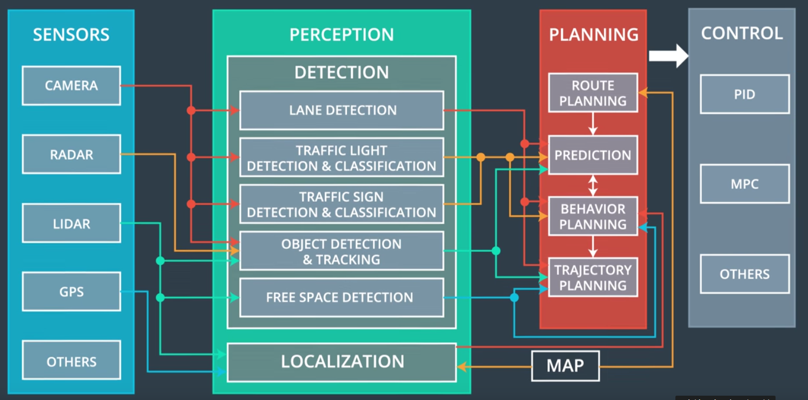

# Autonomous Vehicle Architecture

#### In this module, I will be discussing the system architecture used in the Udacity self-driving car so that you can fit all of the pieces together. The Udacity self-driving car has four major subsystems:

#### 1. The first subsystem is the sensor subsystem which consists of the hardware components that gather data about the environment. This subsystem includes LIDAR, radar, cameras, and even GPS sensors mounted on the car. There are many other types of sensors used in autonomous vehicles like [IMU](https://en.wikipedia.org/wiki/Inertial_measurement_unit) and [Ultrasonic sensors](https://en.wikipedia.org/wiki/Parking_sensor).

#### 2. The second subsystem, the perception subsystem consists of software to process sensor data. Components in the perception subsystem [combine sensor data](https://github.com/A2Amir/Extended-Kalman-Filter-for-Sensor-Fusion-Radar-and-Lidar) into meaningful information. we can think of the perception subsystem as the vehicle center of understanding about its environment. we can also divide the perception subsystem itself into two underlying subsystems; detection and localization.

  1. The localization subsystem is responsible for using sensor and map data to determine the vehicle's precise location.check these projects for more information 1.[Introduction-of-Localization](https://github.com/A2Amir/Introduction-of-Localization) 2.[Markov-Localization-and-the-Kidnapped-Vehicle](https://github.com/A2Amir/Markov-Localization-and-the-Kidnapped-Vehicle-) .
  
  
  2. The detection subsystem is responsible for understanding the surrounding environment. This subsystem includes software components such as; [lane detection](https://github.com/A2Amir/Advanced-Lane-Line-Finding), [traffic sign](https://github.com/A2Amir/Traffic_Sign_Classifier) and traffic light detection classification, object detection and tracking and free space detection.

Each component of the perception subsystem relies on a different group of sensors. For example the object detection component of the perception subsystem might process data from Camera, Lidar and Radar and the localization component primarily uses data from Lidar and map.

#### 3. The planning subsystem is the third subsystem on the vehicle. Once data from the sensors has been processed by the perception subsystem the vehicle can use that information to plan its path. There are several components of the planning system :

  1. [Route planning](https://github.com/A2Amir/Search-Algorithms-A-Star-and-Dynamic-Prgramming): is responsible for high-level decisions about the path of the vehicle between two points on a map  for example which roads, highways, or freeways to take. This component is similar to the route planning feature found on many smartphones or modern car navigation systems. 
  
  2.  [Prediction](https://github.com/A2Amir/Prediction-Phase-in-the-trajectory-generation-of-cars), estimates what actions other objects might take in the future. For example, if another vehicle were identified, the prediction component would estimate its future trajectory.
  
  3.  [Behaviour planning](https://github.com/A2Amir/Behavior-Planning-by-Finite-State-Machine): determines what behavior the vehicle should exhibit at any point in time. For example stopping at a traffic light or intersection, changing lanes, accelerating, or making a left turn onto a new street are all maneuvers that may be issued by this component.
  
  4. [Trajectory generation](https://github.com/A2Amir/Trajectory-Generation): based on the desired immediate behavior, the trajectory planning component will determine which trajectory is best for executing this behavior.

#### 4. The final subsystem is the control subsystem. This subsystem contains software components to ensure that the vehicle follows the path specified by the planning subsystem. The control subsystem may include components such as [PID controllers](https://github.com/A2Amir/PID-Control), model predictive controllers, or other controllers. The control subsystem sense acceleration, braking, and steering commands to the vehicle. This completes the chain of information from sensors to actuation and allows the vehicle to drive.

